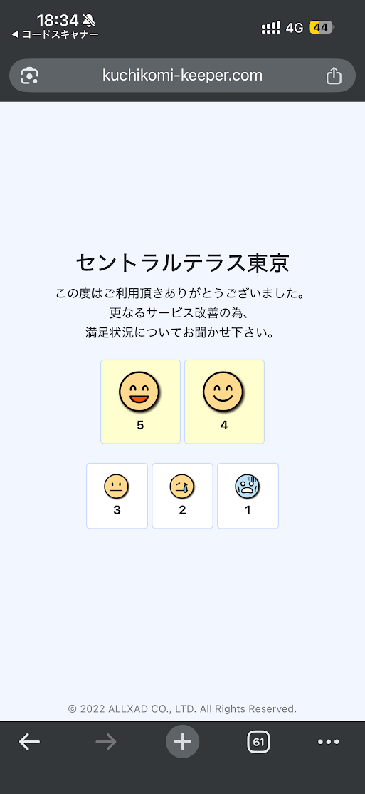

# アプリ仕様書

## 概要


上記画像のような、口コミを集めるシンプルな1ページアプリ。
顧客の満足度に応じて遷移先を振り分ける。

- 評価 5 or 4 → 外部レビューサイトURL（例: Googleマップの口コミ投稿ページ）に遷移
- 評価 3 以下 → Googleフォーム（非公開フィードバック用）に遷移

## 技術スタック

- フロントエンド: HTML / CSS / JavaScript (フレームワークなし)
- バックエンド: なし (静的ファイルのみ)
- ホスティング: 静的サイト (GitHub Pages, Netlify 等)

## 機能一覧

### MVP (必須機能)

- [ ] 機能1: 顧客が満足度を5段階（5〜1）の絵文字ボタンで選択できる
- [ ] 機能2: 評価5 or 4を選択時、設定された外部レビューURLへリダイレクトする
- [ ] 機能3: 評価3以下を選択時、設定されたGoogleフォームURLへリダイレクトする

### あれば嬉しい機能

- [ ] 機能A: 店舗名・遷移先URLをクエリパラメータで設定可能にする（複数店舗対応）
- [ ] 機能B: タップ時のアニメーション（フィードバック感の向上）

## 画面構成

1ページのみのシンプル構成。

| 画面名 | 説明 | 主な要素 |
|--------|------|----------|
| メイン画面 | 満足度を選択する唯一の画面 | 店舗名、案内メッセージ、絵文字評価ボタン(5段階)、フッター |

## 画面レイアウト詳細

上から順に:

1. **店舗名** (太字・大きめ、中央揃え)
   - 例: 「セントラルテラス東京」
2. **案内メッセージ** (中央揃え)
   - 「この度はご利用頂きありがとうございました。」
   - 「更なるサービス改善の為、」
   - 「満足状況についてお聞かせ下さい。」
3. **評価ボタン群**
   - 上段 (大きめ): 5😄 4🙂 ← 横並び2つ
   - 下段 (小さめ): 3😐 2😢 1😨 ← 横並び3つ
   - 各ボタンは枠線付き、絵文字 + 数字で構成
4. **フッター**
   - 「© 2022 ALLXAD CO., LTD. All Rights Reserved.」

## データ構造

データの永続化は不要（バックエンドなし）。

```
設定値 (HTML内の定数として定義):
{
  storeName: 店舗名 (string) 例: "セントラルテラス東京"
  highRatingUrl: 評価4-5の遷移先URL (string) 例: "https://g.page/r/CWRadYEyYRseEBM/review"
  lowRatingUrl: 評価1-3の遷移先URL (string) 例: "https://docs.google.com/forms/d/xxx"
}
```

## UI/デザイン方針

- レスポンシブ対応 (モバイルファースト)
- 背景: ライトグレー (#f0f0f0程度)
- カード: 白背景、中央配置
- 評価ボタン: 枠線付き、黄色背景の絵文字アイコン
- 5と4のボタンは大きめに表示（ポジティブ評価を促す）
- 3, 2, 1のボタンは小さめに表示
- フォントは読みやすいゴシック体

## 制約・前提条件

- サーバーなしで動作すること（静的HTML1ファイルで完結）
- 外部ライブラリ不要
- モダンブラウザ (Chrome, Firefox, Safari最新版) 対応
- スマートフォンでの利用が主なユースケース

## 入出力の具体例

### 入力例

- ユーザーが「5」ボタンをタップ → `highRatingUrl` へ遷移
- ユーザーが「4」ボタンをタップ → `highRatingUrl` へ遷移
- ユーザーが「3」ボタンをタップ → `lowRatingUrl` へ遷移
- ユーザーが「2」ボタンをタップ → `lowRatingUrl` へ遷移
- ユーザーが「1」ボタンをタップ → `lowRatingUrl` へ遷移

### 表示例

画面中央に店舗名と案内文、その下に5段階の絵文字ボタンが並ぶ。
ボタンをタップすると即座に対応するURLへ遷移する（確認画面なし）。
